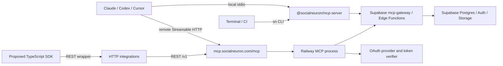

# Social Neuron MCP Full-Stack Adversarial Audit

> **Historical evidence snapshot.** This report records the initial read-only investigation and the production state observed at that time. It is intentionally preserved for traceability, but several recommendations and version statements were superseded by remediation work later on 2026-07-14. Use [Security, Privacy, and Legal Readiness Audit](./2026-07-14-security-privacy-legal-audit.md), [MCP Product and Workflow Improvement Research](./2026-07-14-mcp-product-improvements.md), and the release evidence for the current decision. Do not treat this snapshot as release sign-off.

**Date:** 2026-07-14  
**Status:** Read-only architecture and production-evidence audit  
**Purpose:** Provide a falsifiable, adversarially reviewable plan for making Social Neuron work reliably as an MCP server and CLI before scaling or expanding the SDK surface.  
**Systems covered:** Social Neuron application, private MCP source, public MCP package, Railway, Supabase, Cloudflare/DNS, MCP protocol, OAuth, REST/OpenAPI, CLI, proposed SDK, GitHub/deployment parity, tests, and observability.  
**Production mutation:** None. No files, secrets, infrastructure, DNS records, deployments, OAuth clients, API keys, or database rows were changed during the investigation.

---

## 1. Executive verdict

The hosted service is running and the incident is real. The primary failure is not a Railway process crash, a Supabase outage, Cloudflare, or an absent SDK. It is a mismatch between the current stateful Streamable HTTP implementation and the behavior of remote MCP clients that maintain and reconnect SSE streams.

The intended product can be substantially simpler than the current integration story:

1. **Local stdio MCP** for Claude, Codex, and other desktop/CLI agents.
2. **CLI** backed by the same tool catalogue and handlers.
3. **Hosted stateless Streamable HTTP MCP** for remote clients.
4. **REST/OpenAPI** only for conventional non-MCP integrations.
5. **No public Social Neuron SDK yet.**

Two different things are currently being called an SDK:

- The internal `@modelcontextprotocol/sdk` is the protocol implementation library. It is useful and should remain.
- A public `@socialneuron/sdk` is a convenience wrapper over REST. It is not required for MCP, Claude, Codex, the CLI, the Codex plugin, the REST API, or a directory submission.

The recommended design decision is therefore:

> Keep the MCP protocol SDK, pause the public product SDK, prove stdio and CLI first, make the remote MCP transport stateless, then repair the OAuth contract before scaling or submitting to public directories.

### Current disposition

| Area | Verdict | Confidence |
|---|---|---:|
| Railway process health | Healthy; no crash or 5xx incident found | High |
| Remote MCP session lifecycle | Defective for current client behavior | High |
| Supabase availability | Not the cause of the observed session incident | High |
| Supabase schema/migration governance | Material ledger drift; production schema needs reconciliation | High |
| OAuth interoperability and resource binding | Incomplete/contradictory implementation | High |
| Cloudflare involvement | Not currently in the request path | High |
| Local stdio MCP and CLI strategy | Correct simplest baseline | High |
| Public SDK necessity | Not necessary for the stated goal | High |
| Safe horizontal scaling today | No | High |
| Full production sign-off | Not yet; two closure tests remain | High |

---

## 2. How to read this audit

This report separates evidence from interpretation.

- **Confirmed:** Directly observed in live responses, Railway logs/configuration, DNS, source code, Git history, tests, or linked Supabase migration output.
- **Source-derived:** A direct consequence of the inspected implementation.
- **Inferred:** The best explanation of multiple observations, but not independently proven by a packet capture or controlled reproduction.
- **Unverified:** Requires a dedicated authenticated test account, production database access, Cloudflare dashboard access, or a controlled deployment.

Severity means:

- **P0:** Must be resolved before scaling or relying on the hosted MCP as the primary integration.
- **P1:** Must be resolved before public directory submission or production sign-off.
- **P2:** Important contract, operational, or maintenance debt.
- **P3:** Nice-to-have improvement.

This is not a claim that every P0 is an active data breach. A P0 can also be a foundational reliability or standards gap that blocks a safe launch.

---

## 3. Scope and evidence sources

### 3.1 Repositories and deployed revision

- Private canonical application repository: `ajaknumber4/Social-Neuron`
- Private MCP source: `/Users/cefc/Social-Neuron/mcp-server`
- Public MCP package workspace: `/Users/cefc/mcp-server`
- Live Railway project: `MCP-youthfulness`
- Live Railway service: `Social-Neuron`
- Live environment: `production`
- Live deployed commit: `e20f8de9e4209d8145d05ce2f1d05c3b5af04e01`
- Live MCP version reported by `/health`: `1.8.0`
- Public workspace package version: `1.8.1`
- Private checked-out source package version observed locally: `1.7.18`

The deployed commit is present on the private repository's `origin/main`. The local private checkout was stale/diverged and dirty, but that did **not** indicate deployment drift. The audit used the deployed commit, remote Git history, and live behavior rather than treating the local checkout as authoritative.

### 3.2 Production and protocol evidence

- Railway service and deployment metadata
- Railway application logs across retained runtime deployments
- Railway HTTP request logs queried by status and path
- Live `/health`, OAuth metadata, protected resource metadata, server card, unauthenticated `tools/list`, and OpenAPI responses
- Live DNS and HTTP response headers
- MCP specification version `2025-11-25`
- Installed MCP TypeScript SDK `1.29.0` types and examples
- Current Codex CLI `mcp` command help
- Current Claude MCP setup documentation
- Git commit history for HTTP transport, OAuth persistence, and connector-token hooks
- Supabase migration source, Edge Function source, RLS/index migrations, and one successful linked migration-ledger query
- Existing unit/integration tests and local health scripts

### 3.3 Evidence limitations

The following were not available or were deliberately not performed:

1. No production user API key or OAuth access token was extracted or printed.
2. No authenticated live tool was invoked against a real user's data.
3. No production OAuth client or API key was created solely for this audit.
4. No controlled Railway restart, replica increase, or failover test was performed.
5. Railway does not return all HTTP logs for removed deployments, and CLI queries have result caps.
6. The linked Supabase migration list succeeded once and showed major drift; a later `db lint --linked` attempt could not authenticate because the CLI access token was no longer available.
7. Cloudflare dashboard configuration was not inspected. DNS and response headers prove Cloudflare is not currently authoritative or proxying the MCP host.

These limitations do not weaken the transport diagnosis, but they prevent declaring the OAuth and database layers fully production-certified.

---

## 4. Current system model

### 4.1 Runtime surfaces



### 4.2 What each platform should do

| Platform | Correct responsibility | What it should not be responsible for |
|---|---|---|
| MCP package | Protocol server, tool catalogue, stdio transport, CLI, shared execution contracts | Product-specific public SDK proliferation |
| Railway | Run the remote HTTP MCP and optional REST projection | Persist in-memory sessions across replicas or deploys |
| Supabase | Auth, API-key validation, RLS, data, durable OAuth registrations, Edge Functions, gateway enforcement | Repair MCP transport/session behavior |
| Cloudflare | DNS, optional WAF/rate controls, optional proxy after explicit testing | Create affinity between hidden Railway replicas |
| REST | Serve conventional HTTP clients and OpenAPI consumers | Be a prerequisite for Claude or Codex MCP use |
| Public SDK | Optional developer convenience after stable REST demand exists | Be a launch requirement for MCP/CLI/plugin distribution |

### 4.3 What the simplest successful product looks like

Local agent users should be able to run:

```bash
npx -y @socialneuron/mcp-server login --device

codex mcp add socialneuron -- npx -y @socialneuron/mcp-server

claude mcp add socialneuron -- npx -y @socialneuron/mcp-server
```

Remote agent users should eventually be able to run:

```bash
codex mcp add socialneuron --url https://mcp.socialneuron.com/mcp
codex mcp login socialneuron

claude mcp add --transport http socialneuron https://mcp.socialneuron.com/mcp
# Then use /mcp in Claude Code to authenticate.
```

Neither path requires a public Social Neuron SDK.

---

## 5. Live production snapshot

### 5.1 Railway configuration

**Confirmed:**

- One Hobby-plan replica
- Europe deployment region
- Node `22.23.1`
- Railway V2 runtime
- Root directory `/mcp-server`
- Config file `/mcp-server/railway.toml`
- Build command `npm run build && npm run build:app`
- Start command `node dist/http.js`
- Health path `/health`
- Health timeout 10 seconds
- Restart on failure, maximum 3 retries
- Deployment draining seconds: unset
- Deployment overlap seconds: unset
- Watch patterns: `mcp-server/**`
- Current deployment is running and reports success

Railway uses random load balancing and does not provide sticky sessions. One replica avoids cross-replica misses today, but it does not make the in-memory design scalable.

### 5.2 DNS and Cloudflare

**Confirmed:**

- Authoritative nameservers remain GoDaddy (`ns29`/`ns30.domaincontrol.com`).
- `mcp.socialneuron.com` points to Railway.
- Live headers identify Railway (`railway-hikari`), not Cloudflare.
- Cloudflare is therefore not currently in the MCP request or control path.

The existing DNS migration plan correctly proposes keeping the Railway MCP record DNS-only after a nameserver move. Cloudflare proxying could later add WAF/rate-control value, but it is not required for correctness.

### 5.3 Live protocol surface

**Confirmed:**

- Live server card: 86 public tools
- Live MCP prompts: 5
- Live MCP resources: 4
- OpenAPI has a surface mismatch and exposes `record_heartbeat`
- Unauthenticated `tools/list` returns real tool schemas
- Missing bearer token receives a 401 with `WWW-Authenticate`
- Origin validation is active
- HSTS and relevant CORS exposure headers are present
- No live HTTP 5xx response was found in retained logs

The public repository documentation says 85 public tools. This is documentation/release drift, not evidence that the deployed binary is stale.

---

## 6. Railway log audit

### 6.1 Coverage

The audit queried all retained runtime deployment records and status-specific HTTP logs available through Railway.

Deployment history in the retained week:

| Record type | Count |
|---|---:|
| Deployment triggers | 319 |
| Skipped by path filtering | 289 |
| Removed runtime deployments | 28 |
| Current successful deployment | 1 |
| Failed deployment record | 1 |
| Runtime deployment records inspected | 30 |

The failed build was a manual/wrong-root build that could not find the expected `mcp-server` directory. It did not replace the successful production deployment.

Before the watch patterns were corrected, unrelated monorepo commits created excessive deployment churn. Each real MCP redeploy destroyed all in-memory sessions. The current watch patterns now correctly restrict MCP builds to MCP-path changes.

### 6.2 Application log findings

Across 689 retained application log lines:

- 29 process starts
- 56 shutdown-related messages
- 204 stale sessions cleaned
- No current `POST /mcp` exception pattern
- No auth-router crash pattern
- No uncaught exception
- No unhandled rejection
- No runtime crash loop
- Four historical Express errors:
  - Three unauthenticated `userId` dereferences, fixed on July 12
  - One oversized request body, now mapped to HTTP 413
- One old Node 20 Supabase WebSocket fallback; not present on the current Node 22 deployment
- 154 normal annotation messages incorrectly classified as errors by log level
- 13 Node 20 deprecation messages from older deployments

### 6.3 HTTP status findings

| Status | Count | Interpretation |
|---|---:|---|
| 200 | High volume | Successful initialization, tool traffic, DELETEs, and long-running/reconnecting GET streams |
| 400 | 4 | Two GET and two DELETE requests with missing/invalid sessions |
| 401 | 52 | Mostly unauthenticated GET discovery/connection attempts; two POSTs |
| 403 | 1 | Expected result from the audit's unapproved-Origin OPTIONS test |
| 404 | 12 | Eleven favicon requests and one audit metadata-path probe |
| 409 | 392 | Concurrent/competing GET stream conflicts for existing sessions |
| 429 | 41 | Session/rate pressure; five requests identified as `openai-mcp/1.0.0 (Codex)` |
| 500-599 | 0 | No server failure response found |

409 timing and latency:

- One source address
- Empty user agent
- Activity from approximately 09:38 to 10:45:53 UTC
- Median about 549 ms
- 95th percentile about 682 ms
- Maximum about 1,277 ms
- Bursts approximately every 7-8 minutes, followed by more frequent conflict traffic near the end

429 timing:

- 41 POST requests
- Six source addresses
- 36 empty user agents
- Five identified as Codex
- Activity ended around 10:06 UTC

### 6.4 Session reconstruction

Successful session-related POSTs indicate:

- Ten initial sessions created between 09:25 and 09:40
- Two replacement sessions created around 10:02
- One later manual curl probe

Session teardown evidence:

- Six successful DELETEs between 10:00 and 10:34
- Two invalid DELETEs around 09:50
- Approximately six valid session streams remained after the successful DELETEs

At the final log snapshot, successful GET streams were still reconnecting roughly once per minute. The 409 conflicts had stopped after 10:45:53 UTC, but the background stream churn remained active.

### 6.5 What the logs prove—and do not prove

They prove:

- Railway was serving requests.
- The process was not crashing.
- Supabase/worker failure was not producing the observed status pattern.
- The problem was tied to session/stream lifecycle.
- Multiple client-created sessions survived without complete teardown.

They do not prove:

- Which exact product created every empty-user-agent stream.
- Whether the client behavior itself violates a client implementation expectation.
- Whether the same pattern occurred before retained logs began.
- Whether a stateless implementation will satisfy every future MCP App or server-initiated notification requirement without a controlled test.

---

## 7. Detailed findings

## F-01 — Stateful Streamable HTTP is the primary reliability defect

**Severity:** P0  
**Confidence:** High  
**Type:** Confirmed implementation + production evidence

### Evidence

`mcp-server/src/http.ts` maintains:

- A process-local `Map<string, SessionEntry>`
- A global cap of 500 sessions
- A per-user cap of 10 sessions
- A 30-minute inactivity timeout
- A cleanup interval every five minutes
- A new `McpServer` and transport for every session
- GET-based SSE handling against the stored transport

The live logs show successful long-running GETs, competing GETs rejected as 409, session-cap/rate pressure as 429, partial DELETE cleanup, and continued reconnect traffic.

### Root cause

The service currently treats the remote MCP relationship as a durable in-process session. The observed client repeatedly opens or renews streams. The SDK permits only the stream behavior expected by its stateful transport, so competing GETs become conflicts. Because every accepted GET updates `lastActivity`, reconnecting transport traffic can prevent inactivity expiry indefinitely.

### Why this blocks scaling

Railway routes randomly and has no sticky sessions. With more than one replica:

1. A session can be initialized on replica A.
2. A subsequent GET/POST/DELETE can land on replica B.
3. Replica B has no entry in its process-local map.
4. The request fails or creates inconsistent replacement state.

Cloudflare cannot add affinity when there is only one Railway origin hostname and Railway hides the individual replicas.

### Recommended decision

Use stateless Streamable HTTP for the hosted server:

```ts
new StreamableHTTPServerTransport({
  sessionIdGenerator: undefined,
  enableJsonResponse: true,
});
```

The installed `@modelcontextprotocol/sdk@1.29.0` explicitly supports these options.

Most Social Neuron heavy operations already follow an asynchronous job pattern: a tool returns a job ID and the client polls with another tool call. That application model does not require an MCP transport session to remain alive.

### Counterargument

Future server-to-client notifications, resumability, sampling, elicitation, or MCP App behavior might require state.

### Falsification test

Build a stateless branch and exercise:

- `initialize`
- `tools/list`
- `prompts/list` and `prompts/get`
- `resources/list` and `resources/read`
- synchronous read tool
- asynchronous generation tool returning a job ID
- polling/status tool
- hosted MCP Apps in supporting clients
- Claude, Codex, and MCP Inspector

If a required current workflow cannot operate without server-maintained transport state, the stateless recommendation is falsified for that workflow. The fallback is to remain one replica while designing an explicitly durable state layer—not to scale the current map.

### Acceptance criteria

- Zero process-local MCP session map for the normal hosted path
- No GET stream needed for ordinary tool request/response traffic
- No 409 burst under a 20-client reconnect test
- No session-related 429 under expected concurrency
- Two Railway replicas pass the same test without affinity

---

## F-02 — Session error semantics do not match the current MCP specification

**Severity:** P1  
**Confidence:** High  
**Type:** Source-derived

### Evidence

For GET and DELETE, an unknown or missing `Mcp-Session-Id` returns HTTP 400. For POST, an unknown session ID can fall into the new-session path.

The MCP `2025-11-25` transport specification requires:

- HTTP 400 when a required session ID is missing
- HTTP 404 when a session ID is unknown or terminated, so the client reinitializes

### Risk

Clients cannot reliably distinguish a malformed request from an expired server session. A client may retry an unusable stream instead of performing a clean initialization.

### Recommendation

If any stateful path remains:

- Missing required session ID -> 400
- Unknown/expired session ID -> 404
- Never silently create a replacement session when a nonempty unknown session ID was supplied
- Contract-test the `MCP-Protocol-Version` header on subsequent requests

### Acceptance criteria

- Wire tests cover missing, malformed, unknown, expired, wrong-owner, and valid session IDs
- Claude/Codex recover automatically from a deliberate process restart

---

## F-03 — OAuth access tokens are long-lived API keys and are not resource-bound

**Severity:** P0 before public launch/scale  
**Confidence:** High  
**Type:** Confirmed source behavior

### Evidence

`mcp-server/src/lib/oauth-provider.ts` explicitly documents that OAuth access tokens are `snk_live_*` API keys.

During authorization-code exchange, the Railway provider forwards:

- `client_id`
- `redirect_uri`
- `resource`

The Supabase `mcp-auth?action=exchange-key` implementation reads:

- `code_verifier`
- `state`
- `authorization_code`
- `return_token`
- `redirect_uri`

It does not bind the issued token to `client_id` or `resource`. It decrypts and returns the raw API key, whose default lifetime can be up to 90 days.

The token verifier contains a newer `sno_*` opaque connector-token path with audience checks, but `mcp-auth` does not implement the referenced `validate-connector-token` action.

The provider advertises/implements refresh handling through `refresh-connector-token`, but the Edge Function does not implement that action either. Initial exchanges do not return a refresh token, so this path is mostly dead code today.

Resource normalization also reduces `https://mcp.socialneuron.com/mcp` to the origin `https://mcp.socialneuron.com`, making the accepted audience broader than the most-specific canonical resource recommended by the current specification.

### Risk

- A stolen connector token is a long-lived general Social Neuron API key.
- The token is not cryptographically or durably bound to the requesting OAuth client.
- The token is not restricted to the canonical `/mcp` resource.
- Metadata can advertise refresh behavior that cannot work.
- The implementation looks like short-lived delegated OAuth but behaves like API-key delivery.

### Competing acceptable designs

**Design A — Complete connector-token OAuth:**

- Issue short-lived opaque `sno_*` access tokens
- Bind them to `client_id`, user, scopes, canonical resource, and expiry
- Store only hashes
- Implement validation, rotation, revocation, and refresh-token rotation
- Return refresh tokens only when supported
- Enforce exact `/mcp` audience/resource

**Design B — Explicit API-key model:**

- Do not advertise unsupported refresh semantics
- Clearly disclose that OAuth delivers a long-lived API key
- Reduce token lifetime
- Require easy revocation and rotation
- Decide whether this is acceptable for targeted clients and directory rules

Design A is the standards-aligned target. Design B is simpler but should be treated as an explicit security/product choice, not an accidental intermediate state.

### Adversarial tests

- Replay a token issued for `/mcp` against another protected Social Neuron resource
- Replay a token using a different registered `client_id`
- Request a narrower scope and confirm the issued token cannot call a broader tool
- Revoke a connector and verify cache eviction and immediate rejection
- Attempt refresh-token reuse after rotation
- Attempt token exchange with a changed redirect URI

### Acceptance criteria

- One documented token model
- Metadata matches implemented grants
- Canonical resource includes `/mcp`
- Access token lifetime <= 1 hour for connector OAuth
- Rotating refresh tokens for public clients, if refresh is advertised
- Cross-resource and cross-client replay rejected

---

## F-04 — OAuth challenge and runtime scope behavior need tightening

**Severity:** P1  
**Confidence:** High  
**Type:** Source-derived

### Evidence

The `WWW-Authenticate` helper supports a `scope` parameter, but the initial 401 challenge does not include a least-privilege scope. Clients may therefore fall back to requesting every advertised scope.

At tool execution, insufficient scope is often represented as an MCP tool error or REST error body. The current authorization specification expects an HTTP 403 challenge with `error=insufficient_scope`, the required scope, and protected-resource metadata when authorization must be stepped up at the transport boundary.

### Recommendation

- Choose a minimal initial scope such as `mcp:read` or a narrowly defined discovery scope
- Return a standards-compliant 403 challenge for insufficient scope where the transport/client supports step-up
- Keep tool-level error content for model usability, but do not rely on it as the only OAuth signal

### Acceptance criteria

- 401 missing-token challenge is minimal and discoverable
- 401 invalid-token challenge distinguishes invalid/expired credentials
- 403 insufficient-scope challenge names the required scope
- Client can reconnect or step up without deleting unrelated credentials

---

## F-05 — Dynamic registration and consent enforce different redirect policies

**Severity:** P1  
**Confidence:** High  
**Type:** Confirmed source mismatch

### Evidence

The server-side DCR provider permits:

- Explicit Claude/registry callbacks
- Approved loopback patterns
- Any syntactically valid HTTPS callback

The frontend consent page permits only:

- Claude callbacks
- ChatGPT callback patterns
- Approved loopback patterns

As a result, a standards-compliant HTTPS client can register successfully and then fail on the consent page.

The public auth documentation says unknown HTTPS callbacks are rejected by default, which matches neither the server implementation nor the frontend implementation exactly.

The consent UI also:

- Does not display the redirect URI hostname
- Omits `mcp:autopilot` from its permission list
- Can preselect a requested scope that the UI does not render
- States that the key expires in 30 days while the backend exchange contains 90-day defaults in some paths

### Risk

- Compatibility failures that look like broken OAuth
- Incomplete informed consent
- Scope UI and granted-scope divergence
- Higher phishing/confused-deputy risk for arbitrary HTTPS registrations

### Recommendation

Implement one shared redirect-validation contract or generated allowlist, and display:

- Verified client name
- Full callback hostname and path
- Requested scopes, including autopilot
- Effective plan-limited scopes
- Token lifetime
- Revocation location

### Acceptance criteria

- Registration and consent accept/reject the same URI corpus
- UI renders every supported scope
- Tests include Claude, Codex loopback, ChatGPT, localhost, malicious lookalike domains, fragments, credentials-in-URL, and oversized URIs

---

## F-06 — Supabase migration history is not a reliable production ledger today

**Severity:** P1  
**Confidence:** High  
**Type:** Confirmed linked-ledger output

### Evidence

A linked `supabase migration list` returned a very large set of:

- Matching local/remote timestamps
- Local-only migrations
- Remote-only migrations
- Duplicate local timestamps
- Older shortened remote versions
- Files intentionally renamed with `_applied_` or `_skipped_` prefixes
- Nonconforming SQL files that the CLI skips

Recent production history includes remote timestamps with no same-named local migration and local migrations not represented remotely.

### What this means

It does **not** automatically mean the production schema is broken. It means the repository ledger cannot, by itself, prove which schema objects, grants, policies, indexes, or function versions are active in production.

This is particularly important for:

- `api_keys`
- `pending_mcp_exchanges`
- `complete_pkce_exchange_by_code`
- `mcp_oauth_clients`
- RLS policies
- service-role-only grants
- OAuth-client retention and cleanup

### Existing strengths

The migration sources include good design work:

- Salted/hashed API keys
- Prefix and user indexes
- RLS on API-key and exchange tables
- Short PKCE exchange expiry
- Service-role-only OAuth client storage
- Bounded DCR retention and capacity
- Best-effort `pg_cron` cleanup plus application cleanup
- Later RLS performance and foreign-key index remediation

### Recommendation

Perform a separate database reconciliation audit:

1. Export the production migration ledger.
2. Export production schema-only metadata.
3. Map every remote-only version to its originating change/PR.
4. Resolve duplicate timestamps.
5. Decide which local-only files are intentionally unapplied.
6. Repair the ledger without reapplying destructive SQL.
7. Run `supabase db lint --linked --level warning`.
8. Query production RLS/policy/index definitions for MCP tables.
9. Add a CI rule rejecting duplicate/nonconforming timestamps.

### Adversarial tests

- An authenticated user attempts to alter their own governance columns
- An anon client invokes every security-definer MCP RPC
- A service-role-only table is queried as anon/authenticated
- Expired PKCE exchanges and OAuth clients are actually deleted
- Query plans for API-key validation and OAuth-client lookup use intended indexes

### Acceptance criteria

- No unexplained local-only or remote-only MCP migration
- No duplicate migration timestamps
- Remote lint has no unaccepted security warning
- Production MCP table policies and grants match reviewed source

---

## F-07 — `mcp-auth` has a large mixed public/private action surface

**Severity:** P1  
**Confidence:** Medium-high  
**Type:** Source-derived

### Evidence

Supabase configuration sets `verify_jwt = false` for `mcp-auth`. This is understandable because actions such as PKCE exchange and public key validation need custom/public behavior, but it moves all authorization responsibility into the function's action router.

The same function handles public, authenticated, and service-sensitive actions.

### Risk

- A newly added action can accidentally omit its intended authentication gate.
- Refactors can move parsing or rate limiting before/after the wrong boundary.
- The valid-action error text is already stale relative to implemented actions.

### Recommendation

- Maintain an explicit action authorization matrix in code and tests
- Default-deny unknown/new actions
- Separate public OAuth exchange/validation actions from user-management actions if the router continues growing
- Test every action with no token, anon key, expired JWT, valid user JWT, and service role where appropriate

### Acceptance criteria

- Machine-readable authorization matrix
- Every action has positive and negative auth tests
- Public actions have bounded request size, IP rate limits, replay protection, and non-enumerating errors

---

## F-08 — Railway health is liveness, not MCP readiness

**Severity:** P1  
**Confidence:** High  
**Type:** Confirmed implementation/configuration

### Evidence

`/health` reports process status, version, and commit. `/health/details` reports sessions, memory, and uptime. Neither proves that:

- Supabase Auth is reachable
- `mcp-auth` is reachable
- `mcp-gateway` can validate a canary credential
- DCR persistence works
- the tool executor can call a no-cost backend dependency

Railway uses the configured health check during deployment. It is not a continuous external monitor.

### Recommendation

- Keep `/health` as a cheap liveness endpoint
- Add `/ready` with bounded dependency checks and strict timeouts
- Add an external synthetic MCP canary using a dedicated account/key
- Canary should initialize, list tools, call a no-cost read tool, and close/complete cleanly
- Alert on OAuth conversion failures, tool failures, dependency latency, and session/transport anomalies

### Acceptance criteria

- Railway deploy gate uses readiness where safe
- External monitor runs at least every five minutes
- Release/version/commit/replica identifiers appear in telemetry
- Alerts distinguish auth, transport, dependency, policy, billing, and tool failures

---

## F-09 — Deployment draining and overlap are unset

**Severity:** P1 for stateful mode; P2 after stateless conversion  
**Confidence:** High

### Evidence

Railway reports both `drainingSeconds` and `overlapSeconds` as null.

### Risk

With stateful streams, a deploy can cut active connections and erase all process-local sessions immediately. This was amplified by earlier deployment churn.

### Recommendation

After stateless conversion:

- Test and set a nonzero drain interval
- Consider a small overlap interval
- Confirm the app handles SIGTERM and stops accepting new work
- Make deploy canaries verify the new commit before old traffic is removed

Do not treat draining as a substitute for removing state. It only reduces abrupt termination.

---

## F-10 — REST/OpenAPI is useful but not a prerequisite and currently drifts

**Severity:** P1 contract issue; P2 product-scope issue  
**Confidence:** High

### Evidence

The live REST projection is a generic tool proxy:

- `GET /v1/tools`
- `POST /v1/tools/{name}`
- `GET /v1/openapi.json`

Problems found:

1. OpenAPI builds its server URL by appending `/v1` to `MCP_SERVER_URL`. Because the configured value ends in `/mcp`, the document advertises `https://mcp.socialneuron.com/mcp/v1` rather than `https://mcp.socialneuron.com/v1`.
2. `record_heartbeat` is hidden from the public MCP count but included in OpenAPI/REST filtering.
3. OpenAPI response declarations do not fully describe actual 500/502 outcomes.
4. A source comment incorrectly claims the MCP specification defines unauthenticated `/v1/openapi.json`; OpenAPI is a Social Neuron extension, not an MCP endpoint.
5. The REST executor accesses private SDK `_requestHandlers`, making SDK upgrades fragile.

### Recommendation

- Introduce an explicit `REST_BASE_URL`
- Use the same canonical public-tool predicate for server card, MCP discovery, REST listing, and OpenAPI
- Remove private SDK internals from the REST execution path
- Pin the MCP SDK exactly while any private internal remains
- Add live contract tests comparing tool names, schemas, scopes, and error mappings across MCP and REST

### Product decision

Keep REST if non-agent customers need it. Do not make REST a prerequisite for Claude/Codex or the local CLI.

---

## F-11 — The public Social Neuron SDK is outside the critical path

**Severity:** P2 product focus  
**Confidence:** High

### Evidence

The proposed SDK wraps the REST tool proxy. Existing documentation already labels it preview and not published. The integration plan and submission plan both state that it is not required for MCP/plugin directory submission.

The public repository currently contains SDK-related work and release workflow changes, but there is no demonstrated external consumer requirement in the audited context.

### Recommendation

Pause SDK publication until all are true:

- REST contract is stable
- OpenAPI server URL and public surface are correct
- Live contract tests exist
- At least one real TypeScript integration benefits materially over generated OpenAPI types
- Versioning and deprecation policy are defined

Until then, recommend REST plus OpenAPI generation to application developers.

### Acceptance criteria for future SDK launch

- Zero undocumented divergence from live OpenAPI
- Dedicated package security review
- Server-only credential guidance
- Retry/idempotency semantics documented
- Generated and hand-written method surfaces tested against production canary

---

## F-12 — Tool, resource, prompt, and documentation surfaces drift

**Severity:** P2  
**Confidence:** High

### Evidence

- Documentation says 85 public tools
- Live server card says 86
- OpenAPI exposes an additional hidden/internal surface discrepancy
- Hosted and stdio intentionally substitute MCP Apps vs local screenshot tools
- Five prompts and four resources are registered
- The capabilities resource contains a hand-maintained pricing/tier mirror
- Version strings differ among private source, live deployment, and public package
- `docs/auth.md` describes a deprecated service-role fallback that `initializeAuth()` now rejects fatally
- Root documentation references at least one missing script (`codex:doctor`)

### Risk

- Client expectations and directory submissions become stale
- Pricing/plan claims can diverge from product configuration
- Support cannot identify which version/surface a user has
- Hidden tools can leak through secondary projections

### Recommendation

- Generate counts and tool lists from the canonical catalogue
- Generate pricing/capability resource data from a shared source or backend endpoint
- Publish a surface manifest per release and transport
- Distinguish source version, package version, and deployed release in docs
- Run documentation assertions in CI

---

## F-13 — Unauthenticated `tools/list` is a deliberate interoperability exception

**Severity:** P2 security/product decision  
**Confidence:** High

### Evidence

The server permits unauthenticated `tools/list` and returns real input schemas because some clients discover and cache the catalogue before OAuth. This fixed a genuine interoperability problem where clients stringified complex arguments after seeing empty schemas.

### Risk

- Anyone can enumerate public tool names, descriptions, and schemas
- The endpoint is outside the otherwise protected-resource model
- A growing catalogue increases unauthenticated response size and DoS value

### Countervailing benefit

Without real schemas during pre-auth discovery, many tools become unusable in affected clients.

### Recommendation

Do not remove this casually. Treat it as an explicit exception:

- Document it
- Ensure only the public catalogue is exposed
- Rate-limit and cache the response
- Add strict response-size bounds
- Never include user-specific data, scopes, entitlements, or internal tools
- Retest whether current Claude/Codex versions still require it after OAuth fixes

### Falsification test

If all target clients successfully authenticate and then refresh a protected catalogue with correct schemas, the exception may no longer be necessary.

---

## F-14 — Session cleanup and session telemetry need hardening

**Severity:** P1 while stateful; P3 after stateless conversion  
**Confidence:** High

### Evidence

- Cleanup calls `transport.close()` and `server.close()` without awaiting either promise
- Raw session IDs are written to logs
- GET stream traffic refreshes `lastActivity`
- There is no absolute maximum session age
- There are no privacy-safe lifecycle metrics for initialize/stream/conflict/close/expire

### Recommendation

If stateful mode remains anywhere:

- Await close operations with a timeout
- Hash or redact session IDs
- Separate meaningful application activity from transport heartbeat/reconnect activity
- Add absolute lease duration
- Record lifecycle metrics tagged by hashed user/client, release, and replica

The stateless hosted design removes most of this complexity.

---

## F-15 — Current tests are broad but do not reproduce the production failure mode

**Severity:** P1  
**Confidence:** High

### Evidence

The inspected local private checkout completed:

- 76 test files
- 1,210 passing tests

The deployed commit message reports:

- 1,215 passing tests
- Two pre-existing DNS/environment failures in SSRF tests

The HTTP test suite contains unit-level coverage, but there is no evidence of a real multi-client, concurrent SSE, restart, or multi-replica Railway contract test.

### Recommendation

Add three layers:

1. **Protocol unit tests:** status codes, headers, resource metadata, scopes, protocol version.
2. **Local wire tests:** real HTTP server plus official MCP client/Inspector behavior.
3. **Production canary tests:** dedicated user, OAuth, actual Railway endpoint, safe read-only tool.

### Required adversarial cases

- 20 concurrent clients
- Duplicate GET streams
- Abrupt client termination without DELETE
- Server restart during active request
- Expired/unknown session
- Revoked token during cache lifetime
- Insufficient scope and scope step-up
- Oversized/malformed JSON-RPC
- Cross-user session ID
- Cross-resource token replay
- Two replicas with random routing

---

## 8. Security trust-boundary review

### 8.1 Protected assets

- User API keys and connector tokens
- Supabase service-role key
- User identity, organization, project, and plan
- Social platform OAuth tokens
- Generated media and content
- Publishing/scheduling permissions
- Credit and spend limits
- OAuth client registrations
- Approval gates and autopilot configuration

### 8.2 Trust boundaries

1. Agent client -> Railway MCP endpoint
2. Browser consent UI -> Supabase `mcp-auth`
3. Railway MCP -> Supabase Edge Functions/Data API
4. `mcp-gateway` -> downstream Edge Functions
5. Service-role client -> Postgres/RLS-bypassed access
6. MCP tool handler -> external media/model/social platform APIs
7. REST/OpenAPI consumer -> shared tool executor

### 8.3 Highest-value attack paths to test

| Attack | Current mitigating control | Residual concern |
|---|---|---|
| Session exhaustion | 500 global / 10 per-user caps, rate limiting | Reconnect traffic can keep sessions alive; caps produce 429 instead of recovery |
| OAuth token theft | Hashed storage for API keys, revocation support | Connector receives long-lived raw API key; no resource/client binding |
| DCR storage abuse | 1,000 cache / 5,000 durable limits, retention cleanup | Arbitrary HTTPS registrations; fallback cache resets on deploy |
| Tool enumeration | Public-only catalogue filter | Internal hidden-tool predicate is inconsistent across OpenAPI/REST |
| Cross-tenant data access | Request context, explicit user/project scoping, RLS/gateway | Service-role client bypasses RLS; context/filter mistakes become critical |
| Scope escalation | Tool-to-scope mapping, plan-derived scopes | Challenge/consent/token semantics can diverge |
| Credit bypass | `mcp-gateway`, gateway HMAC tokens | Direct/service-role paths must never bypass unintentionally |
| False health | Process health and error monitoring | `/health` can be green while auth/gateway/database path is broken |
| Redirect URI phishing | Server validation and PKCE | Server/UI policy mismatch; arbitrary HTTPS registration; redirect host not shown |

### 8.4 Existing strengths worth preserving

- Origin validation
- HSTS
- Carefully scoped CORS headers
- Hashed/salted API keys
- RLS on MCP tables
- Short-lived PKCE exchange records
- API-key revocation checked remotely
- Per-request user context for HTTP mode
- Per-user and global session caps
- Rate limits
- Tool-to-scope mapping
- Bounded OAuth-client registration storage
- Deployment watch patterns
- Release commit in `/health`
- Sentry and PostHog integration
- No observed live 5xx or crash loop
- Strong unit-test breadth

---

## 9. Platform-specific conclusions

## 9.1 Railway

Railway is an appropriate host for a stateless remote MCP server. It is not an appropriate implicit session store.

Required before scaling:

- Stateless transport or an explicitly durable state architecture
- Readiness and external canary monitoring
- Deployment drain testing
- Exact SDK pinning
- Release/replica telemetry

Do not add replicas to the current stateful implementation.

## 9.2 Supabase

Supabase is appropriate for:

- Auth
- API-key storage/validation
- Durable OAuth-client registration
- RLS and tenant data
- Edge Functions
- Gateway enforcement

It is not implicated in the 409 stream conflict.

The Railway MCP uses Supabase JS/Data API and Edge Functions rather than maintaining its own direct Postgres pool for normal tool execution. Pooler selection is therefore not the immediate issue. If future server code adds direct Postgres connections, use Supavisor appropriately and size pools against total replica/function concurrency.

Immediate Supabase work is governance/security, not pool tuning:

- Reconcile migration history
- Verify production RLS/grants/indexes
- Complete one OAuth token design
- Audit mixed public/private `mcp-auth` actions
- Run database lint and query-plan checks

## 9.3 Cloudflare

Current conclusion: leave MCP DNS-only.

If proxying later:

- Disable caching for `/mcp`, `/authorize`, `/token`, `/register`, and metadata paths as appropriate
- Preserve `Authorization`, `WWW-Authenticate`, `Mcp-Session-Id`, and `MCP-Protocol-Version`
- Verify streaming/no buffering
- Verify request body limits and timeouts
- Verify Origin behavior
- Add WAF rules carefully so OAuth and JSON-RPC are not blocked
- Test callback and metadata URLs from Claude/Codex networks

Cloudflare proxying does not solve hidden Railway replica affinity.

## 9.4 GitHub and deployment parity

The deployed commit is on the private repository's main branch and is the latest relevant MCP-path commit at the audit point. Existing GitHub/Railway checks were successful.

The local private checkout being stale/diverged is a developer-workspace hygiene concern, not a production parity failure. Future audits should always identify:

- Local HEAD
- `origin/main`
- Latest path-scoped MCP commit
- Railway deployed commit
- Live `/health` commit

before drawing drift conclusions.

## 9.5 Claude and Codex

Both support local stdio and remote HTTP MCP.

The current Codex CLI supports:

- `codex mcp add <name> -- <command>` for stdio
- `codex mcp add <name> --url <url>` for Streamable HTTP
- Bearer-token environment variables
- OAuth client ID
- OAuth resource parameter
- `codex mcp login`

Claude Code supports local stdio, remote HTTP, and OAuth via `/mcp`.

The Social Neuron integration should be tested independently in both clients; success in one does not prove the other client implements reconnection, OAuth discovery, or schema caching identically.

---

## 10. Adversarial review matrix

Use this section to challenge the plan rather than merely confirm it.

| Hypothesis | Supporting evidence | Strongest challenge | Decisive test |
|---|---|---|---|
| Stateless HTTP is the correct remote design | Current tools are request/response or job/poll; session conflicts dominate logs; installed SDK supports stateless mode | MCP Apps or server-initiated capabilities may depend on state | Run full Apps/prompts/resources/tool matrix on a stateless branch in Claude, Codex, and Inspector |
| Railway is not the incident root cause | Process healthy, 0 5xx, one replica, conflicts returned by application/SDK | Railway HTTP/2/SSE behavior could trigger client reconnects | Reproduce same client against local HTTP and another host; compare network trace |
| Supabase is not the session root cause | No dependency-error pattern; status codes are session conflicts/rate limits | Slow auth could cause client retries | Correlate request IDs with auth latency and run a canary using mocked fast auth |
| Cloudflare should remain out of path | It is not currently involved; adding it increases variables | Cloudflare could offer better connection handling or WAF | Stage a separate proxied hostname and compare streaming/OAuth behavior without changing production |
| A public SDK is unnecessary | Claude/Codex use MCP; CLI is in-process; REST works directly | TypeScript customers may need typed convenience | Require concrete consumer design and compare OpenAPI-generated client effort vs maintained SDK cost |
| 409 is mainly a server architecture issue | SDK rejects competing streams; server retains sessions and renews on GET | Misbehaving client may be solely responsible | Use official MCP client/Inspector and packet capture; determine whether standards-compliant client can trigger same condition |
| OAuth must use short-lived connector tokens | Current spec and least-privilege model favor resource/audience binding | Long-lived API keys may be operationally simpler and accepted by target clients | Run directory/security requirements review and cross-resource replay test; document accepted risk if choosing API keys |
| Supabase migration drift is material | Large remote/local ledger mismatch | Schema may still be correct because changes were applied manually | Schema diff + migration-to-PR reconciliation; inspect actual production objects and checksums |
| Horizontal scaling should wait | No sticky sessions; in-memory map | One replica may be sufficient indefinitely | Load/cost forecast; if one replica meets SLO, scaling can be deferred after reliability fixes |

### Questions an adversarial reviewer should answer

1. Which current user workflow concretely requires a persistent MCP transport session?
2. Is there any public-directory requirement that mandates a Social Neuron client SDK?
3. Why should an OAuth connector receive a 30-90-day general API key instead of a one-hour delegated token?
4. Can a token issued through the current OAuth flow be replayed against REST or another resource?
5. Can the deployed process pass a complete authenticated canary while `/health` remains green during a forced Supabase outage?
6. Which system is the canonical source for tool count, tool schema, scope, pricing, and tier availability?
7. What evidence shows every production MCP migration is represented in source control?
8. If Cloudflare is enabled, what exact problem is it solving and how is success measured?
9. What SLO justifies adding replicas, and how will replica-safe behavior be proven?
10. Can a new OAuth action be added to `mcp-auth` without an explicit test proving its authentication requirement?

---

## 11. Recommended implementation sequence

## Phase 0 — Freeze scope and establish baselines

**Goal:** Avoid fixing transport, OAuth, REST, SDK, Cloudflare, and database drift simultaneously.

Actions:

1. Declare stdio MCP + CLI the reference integration.
2. Pause public SDK release work.
3. Record the live tool/scope/schema manifest.
4. Create a dedicated canary user/project and read-only API key.
5. Capture baseline Railway HTTP status/latency and Supabase auth latency.

Exit criteria:

- Reproducible stdio setup in Claude and Codex
- CLI can authenticate, list tools, and call a safe read tool
- Baseline manifest committed

## Phase 1 — Replace hosted session state

**Goal:** Remove the primary incident mechanism.

Likely files:

- `mcp-server/src/http.ts`
- HTTP transport tests
- Railway synthetic checks

Actions:

1. Add a stateless transport implementation.
2. Enable JSON responses.
3. Remove normal hosted dependence on GET/DELETE session lifecycle.
4. Keep a temporary feature flag only if rollback is necessary.
5. Run the full client matrix.

Exit criteria:

- Zero 409 in concurrency/reconnect tests
- No session map growth
- Async job workflows still work
- Apps/prompts/resources verified
- One-replica canary stable for at least 24 hours

## Phase 2 — Complete OAuth coherently

**Goal:** One honest, standards-aligned token model.

Likely files:

- `mcp-server/src/lib/oauth-provider.ts`
- `mcp-server/src/lib/token-verifier.ts`
- `mcp-server/src/lib/www-authenticate.ts`
- `supabase/functions/mcp-auth/index.ts`
- `pages/MCPAuthorize.tsx`
- MCP OAuth migrations and tests

Actions:

1. Choose short-lived connector tokens or explicitly accept API-key OAuth risk.
2. Make `/mcp` the canonical protected resource.
3. Implement audience/client/scope binding.
4. Implement or remove refresh support.
5. Unify redirect validation.
6. Fix consent scope/host/lifetime display.
7. Add 401/403 challenge tests.

Exit criteria:

- Claude, Codex, and Inspector OAuth complete successfully
- Cross-resource/client replay rejected
- Revocation takes effect within the documented bound
- Metadata exactly matches implemented grants

## Phase 3 — Reconcile Supabase production state

**Goal:** Make source control and production schema auditable.

Actions:

1. Export and reconcile the migration ledger.
2. Inspect actual MCP tables, functions, grants, RLS, and indexes.
3. Run remote lint.
4. Add duplicate-timestamp and remote-drift CI checks.
5. Confirm OAuth client cleanup is actually scheduled or reliably application-driven.

Exit criteria:

- No unexplained MCP migration drift
- Reviewed production schema snapshot
- No unaccepted security lint finding

## Phase 4 — Repair REST/OpenAPI and documentation

**Goal:** Make optional secondary surfaces trustworthy.

Actions:

1. Fix REST base URL.
2. Unify public-tool predicates.
3. Remove private SDK handler access.
4. Correct error schemas.
5. Generate tool counts and capability facts.
6. Remove stale service-role and plan language.

Exit criteria:

- Server card, MCP, REST list, and OpenAPI agree
- Live contract test passes
- Documentation has no hard-coded stale count

## Phase 5 — Operations and scale

**Goal:** Scale only after correctness is observable.

Actions:

1. Add `/ready`.
2. Add external MCP/OAuth canary.
3. Add privacy-safe session/transport/auth/tool metrics.
4. Configure drain/overlap.
5. Run two-replica test.
6. Increase replicas only if an SLO/load requirement exists.

Exit criteria:

- Two replicas pass without affinity
- Deploy during canary traffic causes no user-visible error
- Alerts identify injected auth, database, and tool failures

## Phase 6 — Optional Cloudflare proxy and SDK

These are optional optimizations, not completion criteria.

Cloudflare proxy exit criteria:

- A stated goal such as WAF policy, DDoS protection, or consolidated logging
- Staged-host comparison
- No caching/streaming/OAuth regression

SDK exit criteria:

- Real external consumer
- Stable REST/OpenAPI
- Live contract tests
- Versioning/deprecation policy

---

## 12. Go/no-go gates

### Local MCP/CLI launch gate

- [ ] Clean install on macOS, Linux, and Windows-supported path
- [ ] Device/browser login works
- [ ] Codex stdio setup works
- [ ] Claude stdio setup works
- [ ] `tools/list` returns complete schemas
- [ ] Safe read tool succeeds
- [ ] Write/distribute tools enforce confirmation and scopes
- [ ] Revoked key fails promptly

### Hosted remote MCP gate

- [ ] Stateless path proven or state architecture explicitly approved
- [ ] No 409/429 session storm under load
- [ ] Correct 400/404 semantics if any session path remains
- [ ] OAuth resource is canonical `/mcp`
- [ ] Short-lived/resource-bound tokens or documented accepted exception
- [ ] Redirect and consent policy unified
- [ ] Claude, Codex, ChatGPT/custom connector where applicable, and Inspector tested
- [ ] External canary and alerting active
- [ ] Readiness includes bounded dependency evidence

### Horizontal scaling gate

- [ ] No process-local correctness state
- [ ] Two replicas pass random-routing tests
- [ ] Deploy drain behavior tested
- [ ] Capacity target/SLO documented
- [ ] Database and downstream rate limits sized for total concurrency

### Public directory submission gate

- [ ] Accurate tool annotations and action declarations
- [ ] Least-privilege OAuth
- [ ] Privacy/support/legal pages confirmed
- [ ] Test account provided
- [ ] Every submitted tool exercised
- [ ] No hidden/internal tool in public projection
- [ ] Tool count and schemas agree across metadata
- [ ] Write actions require appropriate approval

### REST/SDK gate

- [ ] Correct OpenAPI server URL
- [ ] REST/MCP catalogue parity
- [ ] Stable error envelope
- [ ] No private SDK internals
- [ ] SDK only after consumer demand

---

## 13. Required verification suite

### 13.1 Protocol matrix

| Test | Stdio | HTTP stateless | HTTP stateful fallback | REST |
|---|:---:|:---:|:---:|:---:|
| Initialize/version negotiation | Required | Required | Required | N/A |
| Tools list/schema parity | Required | Required | Required | Required |
| Prompts list/get | Required | Required | Required | N/A |
| Resources list/read | Required | Required | Required | N/A |
| Safe read tool | Required | Required | Required | Required |
| Async job submit/poll | Required | Required | Required | Required |
| Invalid arguments | Required | Required | Required | Required |
| Missing token | N/A/API key startup | Required | Required | Required |
| Insufficient scope | Required | Required | Required | Required |
| Revoked token | Required | Required | Required | Required |
| Unknown session | N/A | N/A | Required | N/A |
| Concurrent/reconnect load | N/A | Required | Required | Required |
| Restart/redeploy | Process restart | Required | Required | Required |

### 13.2 OAuth matrix

- Claude web callback
- Claude Code loopback fixed path
- Codex loopback `/callback` and nonce path
- ChatGPT connector callback patterns
- Generic approved HTTPS callback if supported
- Invalid scheme
- Lookalike hostname
- URL credentials
- Fragment
- Oversized URI
- Multiple redirect URIs
- PKCE mismatch
- Redirect mismatch
- Reused authorization code
- Expired code
- Changed resource
- Changed client ID
- Narrow scope
- Revocation
- Refresh rotation/reuse

### 13.3 Database matrix

- API-key lookup plan
- OAuth-client lookup plan
- RLS as anon
- RLS as authenticated user A/user B
- Service-role-only policy behavior
- Security-definer RPC grants
- Expired exchange cleanup
- OAuth-client retention/capacity
- Governance-column mutation guards
- Duplicate/live subscription and other related tenant constraints where MCP billing depends on them

### 13.4 Operational fault injection

- Supabase Auth unavailable
- `mcp-auth` timeout/429/500
- `mcp-gateway` timeout/429/500
- Database slow query
- Railway SIGTERM during request
- New deployment during canary traffic
- External model provider 429/500
- Large JSON-RPC body
- Malformed/batch JSON-RPC
- Sentry/PostHog unavailable

---

## 14. Metrics and SLO proposal

Start with explicit, modest SLOs and revise from real traffic.

### Availability

- MCP discovery success >= 99.9%
- Authenticated safe-read canary success >= 99.5%
- OAuth completion excluding user denial >= 99%

### Latency

- `/health` p95 < 250 ms
- OAuth metadata p95 < 500 ms
- `tools/list` p95 < 1 second
- Safe read tool p95 target set after baseline

### Correctness

- HTTP 5xx < 0.1%
- Unexpected 409 = 0 in stateless mode
- Session-cap 429 = 0 in stateless mode
- Cross-tenant authorization failure test pass rate = 100%
- Server card/MCP/REST/OpenAPI surface parity = 100%

### Telemetry dimensions

- Release version and commit
- Railway deployment and replica
- Client family where supplied
- Transport
- Auth mode
- Tool name
- Required scope
- Outcome class
- Dependency
- Privacy-safe pseudonymous principal

Never log:

- API keys or tokens
- Raw session IDs
- Tool input/output content by default
- User email
- Generated content
- Upstream error bodies that may contain secrets

---

## 15. What is probably being misunderstood

### “MCP, API, CLI, and SDK are four things we must launch together”

They are not.

- MCP is the agent protocol.
- CLI is another interface to the same capability catalogue.
- REST is an optional conventional HTTP projection.
- SDK is optional convenience code over REST.

For Claude and Codex, MCP is the integration. For terminal users, the CLI is the integration. The SDK adds no required capability.

### “Cloudflare will solve the Railway connection issue”

It will not solve process-local session state behind Railway random routing. It may add useful edge controls later.

### “Supabase pooling is causing the 409s”

The 409s are transport conflicts, not database connection errors. Supabase still needs a schema/auth audit, but it is a separate concern.

### “One replica means the session design is safe”

One replica avoids cross-replica misses but does not prevent reconnect conflicts, leaked sessions, deploy invalidation, or unbounded background stream churn.

### “A green `/health` means the MCP works”

It only proves the process can answer that route. It does not prove OAuth, Supabase, the gateway, or a tool invocation works.

### “A large passing unit suite proves the production protocol works”

It proves substantial logic coverage. It does not reproduce a real client's connection lifecycle, Railway routing, deploy behavior, or OAuth browser flow.

---

## 16. Decisions required from the adversarial review

The review should produce explicit answers to these decisions:

1. **Remote transport:** Approve stateless Streamable HTTP as the default, or document the concrete stateful capability that prevents it.
2. **OAuth token model:** Approve short-lived connector tokens, or explicitly accept long-lived API-key delivery and its risks.
3. **Canonical resource:** Approve `https://mcp.socialneuron.com/mcp` rather than origin-only resource normalization.
4. **Public discovery:** Keep or remove unauthenticated `tools/list` based on a current client matrix.
5. **REST:** Keep as optional product surface or defer it; do not tie MCP launch to it.
6. **SDK:** Pause until consumer demand, or identify the named launch-blocking consumer.
7. **Cloudflare:** Keep DNS-only or state the measurable reason for proxying.
8. **Scaling:** Remain one replica until stateless tests pass; scale only for a documented SLO/capacity need.
9. **Database governance:** Approve a migration-ledger reconciliation as a separate required workstream.
10. **Release gate:** Require authenticated production canary and surface-parity tests before directory submission.

---

## 17. Remaining closure work

This audit is sufficient to choose the architecture. It is not sufficient to sign off the complete production authorization and database system.

Two closure audits remain mandatory:

### 17.1 Authenticated production canary

Using a dedicated test account and least-privilege credentials:

- Complete OAuth in Claude, Codex, and Inspector
- Initialize MCP
- List tools/prompts/resources
- Call a no-cost read tool
- Test insufficient scope
- Revoke and confirm rejection
- Verify clean completion without lingering streams

### 17.2 Supabase production reconciliation

- Restore CLI/database audit access
- Reconcile migration ledger
- Run remote lint
- Inspect actual MCP tables/functions/policies/grants/indexes
- Verify cleanup jobs and query plans

Until those close, the correct label is:

> Architecture and incident diagnosis complete; production OAuth/database certification pending.

---

## 18. Authoritative references

### MCP

- [MCP specification: Streamable HTTP transports](https://modelcontextprotocol.io/specification/2025-11-25/basic/transports)
- [MCP specification: authorization](https://modelcontextprotocol.io/specification/2025-11-25/basic/authorization)
- [MCP specification: tools](https://modelcontextprotocol.io/specification/2025-11-25/server/tools)
- [MCP specification: resources](https://modelcontextprotocol.io/specification/2025-11-25/server/resources)
- [MCP specification: prompts](https://modelcontextprotocol.io/specification/2025-11-25/server/prompts)
- [MCP TypeScript SDK server guide](https://github.com/modelcontextprotocol/typescript-sdk/blob/main/docs/server.md)
- [MCP Inspector](https://modelcontextprotocol.io/docs/tools/inspector)
- [MCP debugging guide](https://modelcontextprotocol.io/docs/tools/debugging)

### Railway

- [Health checks](https://docs.railway.com/deployments/healthchecks)
- [Scaling and replica routing](https://docs.railway.com/deployments/scaling)
- [Deployment teardown and draining](https://docs.railway.com/deployments/deployment-teardown)
- [Reference variables](https://docs.railway.com/variables/reference)
- [Logs](https://docs.railway.com/observability/logs)

### Supabase

- [Database connection management](https://supabase.com/docs/guides/database/connection-management)
- [Connecting to Postgres](https://supabase.com/docs/guides/database/connecting-to-postgres)
- [Edge Functions](https://supabase.com/docs/guides/functions)
- [Edge Function limits](https://supabase.com/docs/guides/functions/limits)

### Cloudflare

- [Proxied vs DNS-only records](https://developers.cloudflare.com/dns/proxy-status/)

### Clients and distribution

- [Claude Code MCP setup](https://docs.anthropic.com/en/docs/claude-code/mcp)
- [Anthropic MCP connector](https://docs.anthropic.com/en/docs/agents-and-tools/mcp-connector)
- [OpenAI: Plugins in Codex](https://help.openai.com/en/articles/20001256-plugins-in-codex/)

---

## 19. Key source files reviewed

Private Social Neuron repository:

- `mcp-server/src/http.ts`
- `mcp-server/src/index.ts`
- `mcp-server/src/lib/oauth-provider.ts`
- `mcp-server/src/lib/token-verifier.ts`
- `mcp-server/src/lib/www-authenticate.ts`
- `mcp-server/src/lib/openapi.ts`
- `mcp-server/src/lib/register-tools.ts`
- `mcp-server/src/lib/supabase.ts`
- `mcp-server/src/resources.ts`
- `mcp-server/src/prompts.ts`
- `mcp-server/src/auth/scopes.ts`
- `mcp-server/src/lib/tool-catalog.ts`
- `mcp-server/railway.toml`
- `supabase/config.toml`
- `supabase/functions/mcp-auth/index.ts`
- `pages/MCPAuthorize.tsx`
- MCP API-key, PKCE, OAuth-client, RLS, grant, retention, and index migrations
- Cloudflare/DNS migration plan and DNS verification script

Public MCP repository:

- `README.md`
- `package.json`
- `server.json`
- `docs/auth.md`
- `docs/cli-guide.md`
- `docs/rest-api.md`
- `docs/sdk-guide.md`
- `docs/integration-methods.md`
- `docs/ROADMAP.md`
- `docs/tools-reference.md`
- `docs/submissions/official-directory-plan.md`
- `docs/submissions/openai-plugin-submission.md`
- `docs/submissions/anthropic-connector-submission.md`
- MCP server, SDK, CI, and release workflows

---

## 20. Final recommendation

Approve the following narrow plan unless an adversarial test falsifies it:

1. Ship and support stdio MCP + CLI as the baseline.
2. Convert the hosted Railway MCP to stateless Streamable HTTP.
3. Complete a single short-lived, resource-bound OAuth token model.
4. Reconcile Supabase production migrations and authorization objects.
5. Add an authenticated external canary and real client lifecycle tests.
6. Repair REST/OpenAPI parity, but keep REST optional.
7. Keep Cloudflare DNS-only unless a measurable edge requirement emerges.
8. Do not add Railway replicas until stateless random-routing tests pass.
9. Do not publish the Social Neuron SDK until a real consumer and stable REST contract justify it.

This plan removes unnecessary surface area, directly addresses the observed failure, and leaves explicit tests that can disprove its assumptions before production expansion.
