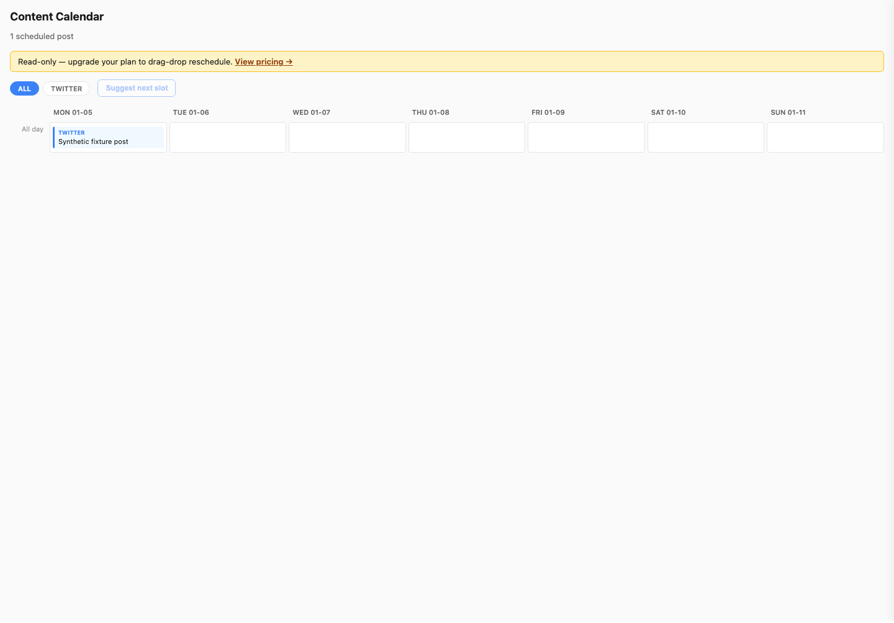
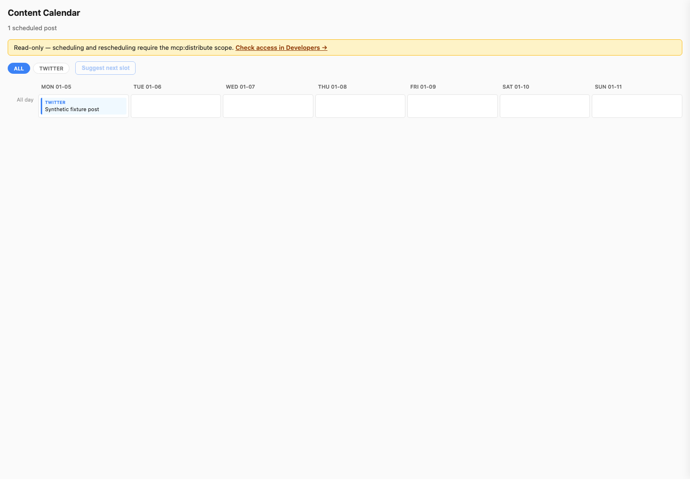
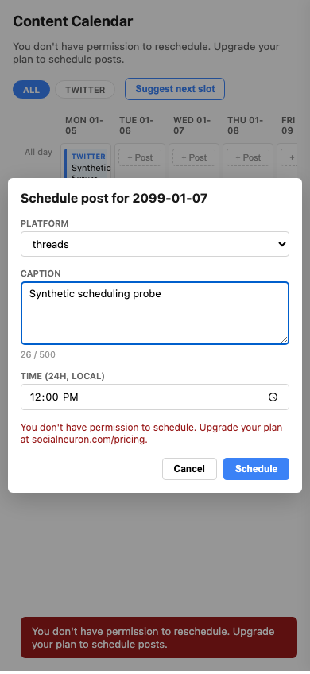
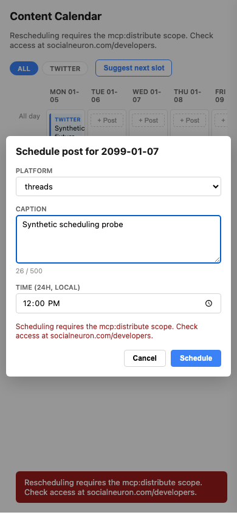

# Calendar permission guidance proof

Public built MCP App before/after browser verification uses synthetic project/posts and a local MCP host. Each phase ran desktop and mobile read-only plus slot/reschedule/schedule scope-denial flows: four browser contexts, eight screenshots, no external requests or page/console/host errors.

Only visible permission copy and the access-help link changed. Read-only mutation controls remain unavailable; denied rescheduling restores the original date; denied scheduling remains retryable. Tool names and requests are unchanged. This does not certify acceptance by a production host.

Before HTML SHA256: `7a0296d9a89ea4d41eaa576d8634452e1dba8b2b47c6b33b5ff1b9f6e96eb676` (252061 bytes).

After HTML SHA256: `3d5cadae169f1c4fa641c0b7db1048f9d05ee5169acf22216d54f152e290b989` (252146 bytes).

| State | Before | After |
|---|---|---|
| Desktop read-only |  |  |
| Mobile schedule denied |  |  |
